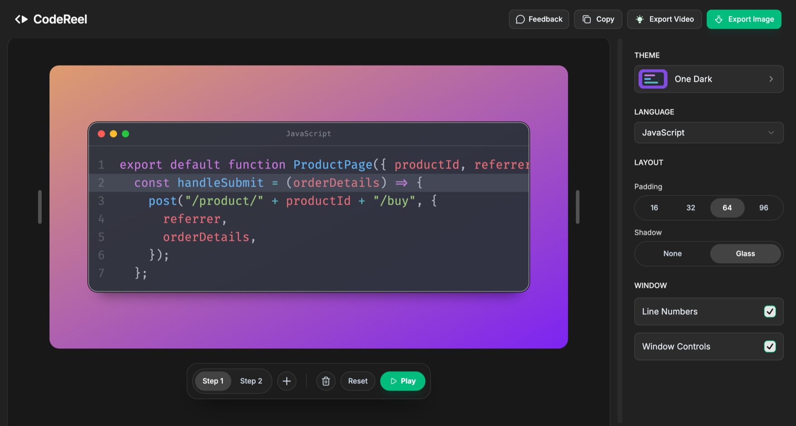

# CodeReel

A browser-only code snippet editor: write your steps, style the frame, play the
animation, and export images. Everything runs in the browser — there is no
backend, no API route, and no server-side rendering of user data.

**Try it at [codereel.dev](https://www.codereel.dev/app)** — no sign-up, no install.

## Why CodeReel

Carbon and ray.so turn one snippet into one static image. CodeReel lets you
walk through code step by step: write several versions of the snippet, and
the frame animates from one to the next, with lines moving, appearing, and
fading in place. That makes it a good fit for tutorials, talks, and short
videos where you want to show how the code changes, not just what it ends up as.

|                       | Carbon / ray.so | CodeReel |
| --------------------- | --------------- | -------- |
| Styled code image     | ✅              | ✅       |
| Multiple steps        | —               | ✅       |
| Animated transitions  | —               | ✅       |
| No account, no upload | ✅              | ✅       |

Your code never leaves the browser: there is no backend to send it to.

## The editor

Type your code straight into the frame and click line numbers to highlight
them. Add and switch steps from the toolbar below, pick a theme and layout in
the panel on the right, then play the sequence to see the code morph between
steps.



## Run Locally

**Prerequisites:** Node.js, pnpm

```
pnpm install
pnpm dev
```

## Build

```
pnpm build
pnpm start
```

## Exports

- **Images** (PNG / JPEG / WebP) are rendered in the browser via `modern-screenshot`.
- **Video**: use the in-app Recording Guide — play the animation and capture the
  highlighted region with your own screen recorder (CleanShot, OBS, etc.).
